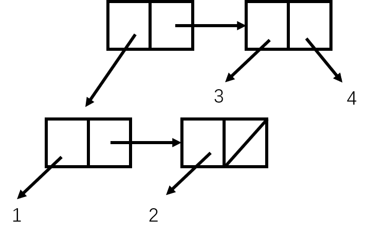
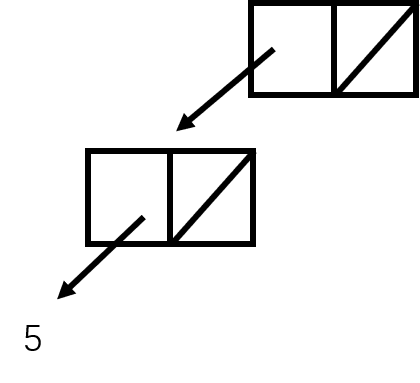
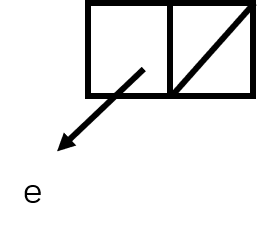

# Sample midterm 1

## Problem 1 (What will Scheme print?) (-3)

```Scheme
(every - (keep number? '(the 1 after 909))) ; '(-1 -999)

((lambda (a b) ((if (< b a) + *) b a)) 4 6) ; 24

(word (first '(cat)) (butlast 'dog)) ; catdo
```

```Scheme
(cons (list 1 2) (cons 3 4)) ; ((1 2) 3 . 4)

(let ((p (list 4 5)))
  (cons (cdr p) (cddr p))) ; '((5))

(cadadr '((a (b) c) (d (e) f) (g (h) i))) ; '(e)
```







## Problem 2 (Orders of growth)

(a) $\theta(1)$

(b) $\theta(n^2$

## Problem 3 (normal and applicative order)

- under applicative order: 2
- under normal order: 2

## Problem 4 (Iterative and recursive processes) (-1)

first/_second_

## Problem 5 (Recursive procedures)

```Scheme
(define (vowel? letter)
  (member? letter '(a e i o u)))

(define (syllables word)
  (cond ((empty? word) 0)
        ((vowel? (first word))
          (cond ((empty? (bf word)) 1)
                ((vowel? (first (bf word))) (syllables (bf word)))
                (else (+ 1 (syllables (bf word))))))
        (else (syllables (bf word)))))
```

## Problem 6 (Higher order functions)

```Scheme
(define (in-order? PRED sent)
  (cond ((or (empty? sent) (empty? (bf sent))) #t)
        ((not (PRED (first sent) (first (bf sent)))) #f)
        (in-order? PRED (bf sent))))
```

```Scheme
(define (order-checker PRED)
  (lambda (sent) (in-order? PRED sent)))
```

## Problem 7 (Data abstraction)

(a):

```Scheme
(define (time-print-form time)
  (word (hour time) ': (two-digit (minute time)) (category time)))

(define (two-digit num)
  (if (< num 10)
      (word 0 num)
      num))
```

(b):

```Scheme
(define (24-hour time)
  (+ (* (hour time) 100)
     (minute time)
     (if (equal? (category time) 'am) 0 1200)))
```

(c):

```Scheme
(define (make-time hr min cat)
  (+ (* hr 100)
     min
     (if (equal? cat 'pm) 1200 0)))

(define (hour time)
  (if (>= time 1200)
      (- (div time 100) 12)
      (div time 100)))

(define (minute time)
  (remainder time 100))

(define (category time)
  (if (>= time 1200) 'pm 'am))
```
