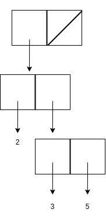
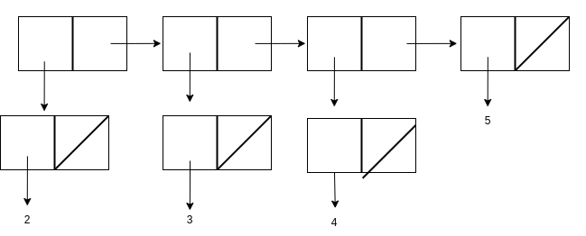
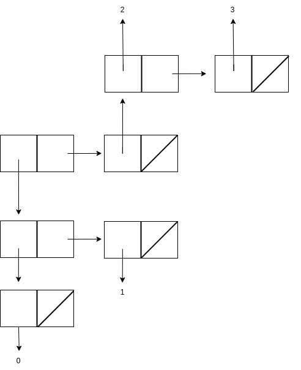

# Sample midterm 2

## Problem 1

a. error

b. ((2 3 . 5))



c. ((2) (3) (4) 5)



d. (((0) 1) (2 3))



## Problem 2 (Tree Recursion)

a. the code as below:

```Scheme
(define (entry tree) (car tree))

(define (left-branch tree) (cadr tree))

(define (right-branch tree) (caddr tree))

(define (make-tree entry left right)
    (list entry left right))

(define (all-smaller? tree val)
    (cond ((null? tree) #t)
          ((< (entry tree) val)
           (and (all-smaller? (left-branch tree) val)
                (all-smaller? (right-branch tree) val)))
          (else #f)))
```

b. the code is as below:

```Scheme
(define (all-larger? tree val)
    (cond ((null? tree) #t)
          ((> (entry tree) val)
           (and (all-larger? (left-branch tree) val)
                (all-larger? (right-branch tree) val)))
          (else #f)))
(define (bst? tree)
    (cond ((null? tree) #t)
          ((and (all-smaller? (left-branch tree) (entry tree))
                (all-larger? (right-branch tree) (entry tree)))
           (and (bst? (left-branch tree))
                (bst? (right-branch tree))))
          (else #f)))
```


## Problem 3 (Tree Recursion)

```Scheme
(define (max-fanout tree)
    (if (null? tree)
        0
        (max (fanout tree)
             (max (map max-fanout (children tree))))))

(define (fanout node)
    (if (null? node)
        0
        (length (children node))))
```

## Problem 4 (Data-directed Programming)

```Scheme
(define (plus x y)
    (let ((tag-x (type-tag x))
          (tag-y (type-tag y))
          (content-x (contents x))
          (content-y (contents y))
          (x->y (get tag-x tag-y))
          (y->x (get tag-y tag-x)))
        (cond ((equal? tag-x tag-y) (attach-tag tag-x (+ content-x content-y)))
              ((and x->y (number? x->y)) (attach-tag tag-y (+ (* x->y content-x) content-y)))
              ((and y->x (number? y->x)) (attach-tag tag-x (+ content-x (* y->x content-y))))
              (else (error "you can't add" tag-x "and" tag-y)))))
```

## Problem 5 (Object-Oriented Programming)

a. Neither

b.

```Scheme
(method (flavors)
  (map (LAMBDA (S) (ASK S 'FLAVOR)) scoops))
```
c. `(ask my-cone 'add-scoop (instantiate vanilla))`

