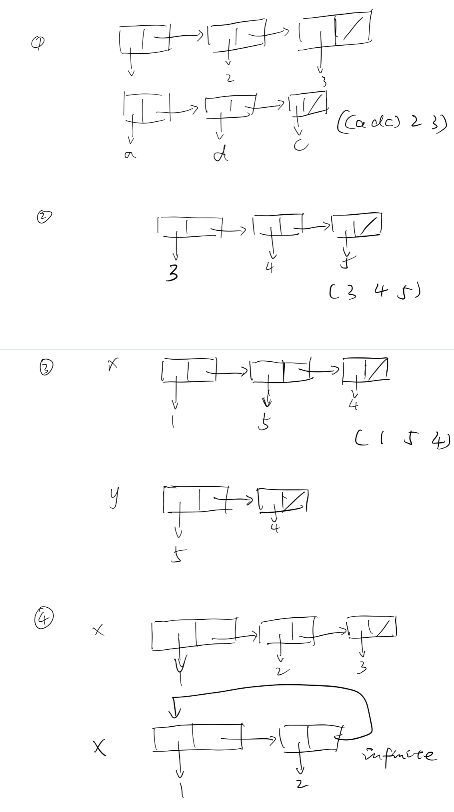

# Sample midterm 3

## Problem 1 (box and pointer)



## Problem 2 (Assignment, State, and Environments)

The correct one is:

```Scheme
(define (prev proc)
  (let ((old-result #f))
    (lambda (x)
      (let ((return-value old-result))
        (set! old-result (proc x))
        return-value))))
```

## Problem 3 (Drawing environment diagrams)


## Problem 4 (List mutation)

```Scheme
(define (make-alist! lst)
  (define (helper lst)
    (if (null? lst)
        'done
        (let ((next (cdr lst))
              (next2 (cddr lst))
              (first (car lst))
              (second (cadr lst)))
          (set-car! lst next)
          (set-cdr! lst next2)
          (set-car! next first)
          (set-cdr! next second)
          (helper next2))))
  (helper lst))
```

## Problem 5 (Vectors)

```Scheme
(define (histogram scores)
  (let ((M (vector-max scores)))
    (let ((res (make-vector (+ 1 M))))
      (define (loop n)
        (if (< n 0)
            res
            (begin (vector-set! res (vector-ref scores n)
                                    (+ 1 (vector-ref res (vector-ref scores n))))
                   (loop (- n 1)))))
      (loop (- (vector-length scores) 1)))))
```

## Problem 6 (Concurrency)

(a). deadlock

(b). inefficency

(c). none of the above

## Problem 7 (Streams)

```Scheme
(define foo
  (cons-stream '()
               (interleave (stream-map (lambda (p) (cons 'over p)) foo)
                           (stream-map (lambda (p) (cons 'under p)) foo))))

(define patterns
  (stream-filter (lambda (p) (and (member 'over p) (member 'under p)))
                 foo))

```
