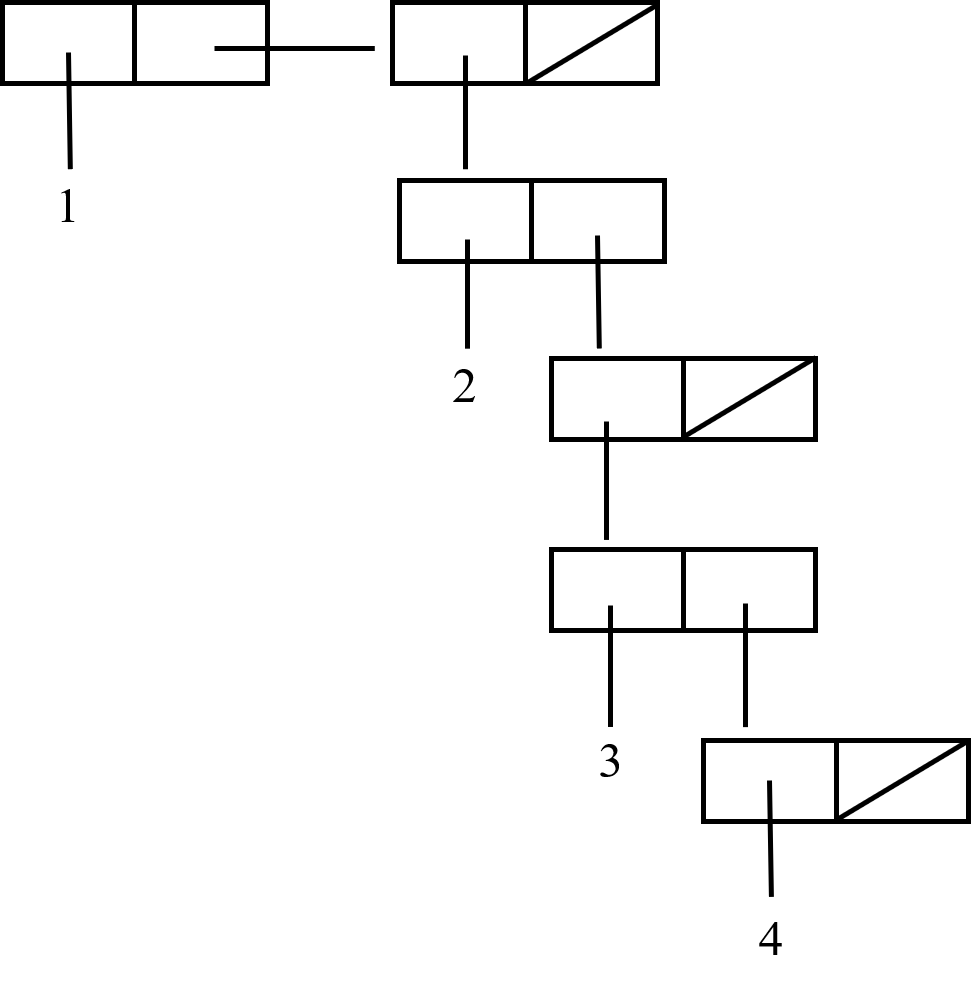

# CS 61A Week 5 Homework

Topic: Hierarchical data

Reading: Abelson & Sussman, Section 2.2.2-2.2.3, 2.3.1, 2.3.3

## Homework

Problem 1: Abelson & Sussman, exercises 2.24, 2.26, 2.29, 2.30, 2.31, 2.32, 2.36, 2.37, 2.38, 2.54

**2.24:**

value: '(1 (2 (3 4)))

box-and-pointer structure:



tree structure:


**2.26:**

```Scheme
(append x y) ; (1 2 3 4 5 6)
(cons x y) ; ((1 2 3) 4 5 6)
(list x y) ; ((1 2 3) (4 5 6))
```

**2.29:**

a. define `left-branch` and `right-branch` and `branch-length` and `branch-structure`

```Scheme
(define (left-branch mobile)
  (car mobile))

(define (right-branch mobile)
  (cadr mobile))

(define (branch-length branch)
  (car branch))

(define (branch-structure branch)
  (cadr branch))
```

b. define `total-weight`

```Scheme
(define (total-weight mobile)
  (+ (branch-weight (left-branch mobile))
     (branch-weight (right-branch mobile))))

(define (branch-weight branch)
  (let ((struct (branch-structure branch)))
    (if (number? struct)
        struct
        (total-weight struct))))
```

c.

```Scheme
(define (branch-torque branch)
  (* (branch-length branch) (branch-weight branch)))

(define (mobile-balanced? mobile)
  (and (= (branch-torque (left-branch mobile))
          (branch-torque (right-branch mobile)))
       (branch-balanced? (left-branch mobile))
       (branch-balanced? (right-branch mobile))))

(define (branch-balanced? branch)
  (let ((struct (branch-structure branch)))
    (if (number? struct)
        #t
        (mobile-balanced? struct))))
```

d.

```Scheme
(define (make-mobile left right)
  (cons left right))

(define (make-branch length structure)
  (cons length structure))

(define (left-branch mobile)
  (car mobile))

(define (right-branch mobile)
  (cdr mobile))

(define (branch-length branch)
  (car branch))

(define (branch-structure branch)
  (cdr branch))
```

**2.30:**

```Scheme
(define (square-tree tree)
  (if (list? tree)
      (map (lambda (t) (square-tree t)) tree)
      (square tree)))
```

**2.31:**

```Scheme
(define (tree-map fn tree)
  (if (list? tree)
      (forest-map fn tree)
      (fn tree)))

(define (forest-map fn forest)
  (if (null? forest)
      '()
      (cons (tree-map fn (car forest)) (forest-map fn (cdr forest)))))
```

**2.32:**

```Scheme
(define (subsets s)
  (if (null? s)
      (list null)
      (let ((rest (subsets (cdr s))))
        (append rest (map (lambda (x) (cons (car s) x)) rest)))))
```

for example, there is a set `(1 2 3)`.

firstly, `(1 2 3)` is not null, so rest equals subsets of list `(2 3)`

secondly, `(2 3)` is not null, so rest equals subsets of list `(3)`

thirdly, `(3)` is not null, so rest equals subsets of list `()`

fourthly, `()` is null, so return `(())`

so back to the third, rest equals to `(())`, so the subsets of `(3)` is `(() (3))`

so back to the second, rest equals to `(() (3))`, so the subsets of `(2 3)` is `(() (3) (2) (2 3))`

finally, back to the first, rest equals to `(() (3) (2) (2 3))`, so the subsets of `(1 2 3)` is `(() (3) (2) (2 3) (1) (1 3) (1 2) (1 2 3))`

**2.36:**

```Scheme
(define (accumulate-n op init seqs)
  (if (null? (car seqs))
      null
      (cons (accumulate op init (map (lambda (seq) (car seq)) seqs))
            (accumulate-n op init (map (lambda (seq) (cdr seq)) seqs)))))
```

**2.37:**

```Scheme
(define (matrix-*-vector m v)
  (map (lambda (v1) (dot-product v1 v)) m))

(dot-product '(1 2 3) '(1 2 3))

(matrix-*-vector '((1 2 3) (4 5 6)) '(1 2 3))

(define (transpose mat)
  (accumulate-n cons '() mat))

(transpose '((1 2 3 4) (4 5 6 6) (6 7 8 9)))

(define (matrix-*-matrix m n)
  (let ((cols (transpose n)))
    (map (lambda (seq) (matrix-*-vector cols seq)) m)))

(matrix-*-matrix '((1 2 3 4) (4 5 6 6) (6 7 8 9))
                 '((1 4 6) (2 5 7) (3 6 8) (4 6 9)))
```

**2.38:**

```Scheme
(fold-right / 1 (list 1 2 3)) ; 3/2
(fold-left / 1 (list 1 2 3)) ; 1/6
(fold-right list nil (list 1 2 3)) ; (1 (2 (3 ())))
(fold-left list nil (list 1 2 3)) ; (((() 1) 2) 3)
```

op must to be communicative to guarantee that `fold-right` and `fold-left` produce the same values.

**2.54:**

```Scheme
(define (equal? a b)
  (cond ((and (symbol? a) (symbol? b)) (eq? a b))
	((or (symbol? a) (symbol? b)) #f)
	((and (number? a) (number? b)) (= a b))       ;; not required but
	((or (number? a) (number? b)) #f)             ;; suggested in footnote
	((and (null? a) (null? b)) #t)
	((or (null? a) (null? b)) #f)
	((equal? (car a) (car b)) (equal? (cdr a) (cdr b)))
	(else #f)))
```

Problem 2: See File [calc](calculator/calc.rkt)

## Extra for experts

**2.67:**

```Scheme
(define sample-tree
  (make-code-tree (make-leaf 'A 4)
                  (make-code-tree
                   (make-leaf 'B 2)
                   (make-code-tree
                    (make-leaf 'D 1)
                    (make-leaf 'C 1)))))

(define sample-message '(0 1 1 0 0 1 0 1 0 1 1 1 0))

(decode sample-message sample-tree) ;(A D A B B C A)
```

**2.68:**

```Scheme
(define (encode-symbol symbol tree)
  (if (leaf? tree)
      (if (eq? symbol (symbol-leaf tree))
          '()
          (error "MISSING SYMBOL" symbol))
      (let ((left (left-branch tree)))
        (if (member? symbol (symbols tree))
            (cons 0 (encode-symbol symbol left))
            (cons 1 (encode-symbol symbol (right-branch tree)))))))
```

**2.69:**

```Scheme
(define (generate-huffman-tree pairs)
  (successive-merge (make-leaf-set pairs)))

(define (successive-merge leafs)
  (cond ((null? leafs) (make-code-tree '() '()))
        ((null? (cdr leafs)) (car leafs))
        (else (let ((first (car leafs))
                    (second (cadr leafs)))
                (successive-merge (adjoin-set
                                   (make-code-tree first second)
                                   (cddr leafs)))))))
```

**2.70:**

```Scheme
(define rock-song (generate-huffman-tree
           '((A 2) (GET 2) (SHA 3) (WAH 1) (BOOM 1) (JOB 2) (NA 16) (YIP 9))))

(encode '(GET A JOB) rock-song)
(encode '(SHA NA NA NA NA NA NA NA NA) rock-song)
(encode '(GET A JOB) rock-song)
(encode '(SHA NA NA NA NA NA NA NA NA) rock-song)
(encode '(WAH YIP YIP YIP YIP YIP YIP YIP YIP YIP) rock-song)
(encode '(SHA BOOM) rock-song)
```

So we need 84 bits to encode this song.

**2.71:**

We need only one bits to encode the most frequent symbol, and `n-1` bits to encode the least frequent symbol.

**2.72:**

Since only one branch is followed at each step of the encoding, the number of steps is at worst the depth of the tree. And the time per step, as the exercise points out, is determined by the call to MEMBER to check whether the symbol is in the left branch. If there are N symbols, it's easy to see that the worst case is N^2 time, supposing the tree is very unbalanced [in 2.71 I said that an unbalanced tree isn't a problem, but that's in determining the size of the encoded message, not the time required for the encoding] so its depth is N, and we have to check at most N symbols at each level.

In reality, though, it's never that bad. The whole idea of Huffman coding is that the most often used symbols are near the top of the tree. For the power-of-two weights of exercise 2.71, the average number of steps to encode each symbol is 2, so the time is 2N rather than N^2. (The worst-case time is for the least frequently used symbol, which still takes N^2 time, but that symbol only occurs once in the entire message!) We could make a small additional optimization by rewriting ENCODE-SYMBOL to make sure that at each branch node in the tree it creates, the left branch has fewer symbols than the right branch.

**Regroup:** (TODO)

```Scheme
;; Programming by example:

;; Of course many approaches are possible; here's mine:

(define (regroup pattern)

  ;; my feeble attempt at data abstraction:
  ;; regroup0 returns two values in a pair

  (define reg-result cons)
  (define reg-function car)
  (define reg-minsize cdr)

  ;; Assorted trivial utility routines

  (define (firstn num ls)
    (if (= num 0)
	'()
	(cons (car ls) (firstn (- num 1) (cdr ls))) ))

  (define (too-short? num ls)
    (cond ((= num 0) #f)
	  ((null? ls) #t)
	  (else (too-short? (- num 1) (cdr ls))) ))

  (define (safe-bfn num ls)
    (cond ((null? ls) '())
	  ((= num 0) ls)
	  (else (safe-bfn (- num 1) (cdr ls))) ))

  (define (firstnum pattern)
    (if (symbol? pattern)
	pattern
	(firstnum (car pattern)) ))

  (define (and-all preds)
    (cond ((null? preds) #t)
	  ((car preds) (and-all (cdr preds)))
	  (else #f) ))

  ;; Okay, here's the real thing:

  ;; There are three kinds of patterns: 1, (1 2), and (1 2 ...).
  ;; Regroup0 picks one of three subprocedures for them.
  ;; In each case, the return value is a pair (function . min-size)
  ;; where "function" is the function that implements the pattern
  ;; and "min-size" is the minimum length of a list that can be
  ;; given as argument to that function.

  (define (regroup0 pattern)
    (cond ((number? pattern) (select pattern))
	  ((eq? (last pattern) '...) (infinite (bl pattern)))
	  (else (finite pattern)) ))


  ;; If the pattern is a number, the function just selects the NTH element
  ;; of its argument.  The min-size is N.

  (define (select num)
      (reg-result
       (cond ((= num 1) car)	; slight optimization
	     ((= num 2) cadr)
	     (else (lambda (ls) (list-ref ls (- num 1)))) )
       num))

;; If the pattern is a list of patterns without ..., the function
  ;; concatenates into a list the results of calling the functions
  ;; that we recursively derive from the subpatterns.  The min-size
  ;; is the largest min-size required for any subpattern.

  (define (finite pattern)
    (let ((subgroups (map regroup0 pattern)))
      (reg-result
       (lambda (ls) (map (lambda (subg) ((reg-function subg) ls)) subgroups))
       (apply max (map reg-minsize subgroups)) ) ))

  ;; Now for the fun part.  If the pattern is a list ending with ... then
  ;; we have to build a map-like recursive function that sticks the result
  ;; of computing a subfunction on the front of a recursive call for some
  ;; tail portion of the argument list.  There are a few complications:

  ;; The pattern is allowed to give any number of examples of its subpattern.
  ;; For instance, ((1 2) ...), ((1 2) (3 4) ...), and ((1 2) (3 4) (5 6) ...)
  ;; all specify the same function.  But ((1 2) (3 4 5) ...) is different from
  ;; those.  So we must find the smallest leading sublist of the pattern such
  ;; that the rest of the pattern consists of equivalent-but-shifted copies,
  ;; where "shifted" means that each number of the copy differs from the
  ;; corresponding number of the original by the same amount.  (3 4) is a
  ;; shifted copy of (1 2) but (3 5) isn't.  Once we've found the smallest
  ;; appropriate leading sublist, the rest of the pattern is unused, except
  ;; as explained in the following paragraph.

  ;; Once we have the pattern for the repeated subfunction, we need to know
  ;; how many elements of the argument to chop off for the recursive call.
  ;; If the pattern contains only one example of the subfunction, the "cutsize"
  ;; is taken to be the same as the min-size for the subfunction.  For example,
  ;; in the pattern ((1 2) ...) the cutsize is 2 because 2 is the highest
  ;; number used.  But if there are two or more examples, the cutsize is the
  ;; amount of shift between examples (which must be constant if there are
  ;; more than two examples), so in ((1 2) (3 4) ...) the cutsize is 2 but in
  ;; ((1 2) (2 3) ...) it's 1.  In ((1 2) (2 3) (5 6) ...) the shift isn't
  ;; constant, so this is taken as one example of a long subpattern rather
  ;; than as three examples of a short one.

  ;; Finally, if the subpattern is a single number or list, as in (1 3 ...)
  ;; (that's two examples of a one-number pattern) or ((1 2) ...), then we
  ;; can cons the result of the subfunction onto the recursive call.  But if
  ;; the subpattern has more than one element, as in (1 2 4 ...) or
  ;; ((1 2) (3 4 5) ...), then we must append the result of the subfunction
  ;; onto the recursive call.

  ;; INFINITE does all of this.  FINDSIZE returns a pair containing two
  ;; values: the number of elements in the smallest-appropriate-leading-sublist
  ;; and, if more than one example is given, the shift between them, i.e., the
  ;; cutsize.  (If only one example is given, #T is returned
  ;; in the pair instead of the cutsize.)  PARALLEL? checks to see if a
  ;; candidate smallest-appropriate-leading-sublist is really appropriate,
  ;; i.e., the rest of the pattern consists of equivalent-but-shifted copies.
  ;; The return value from PARALLEL? is the amount of shift (the cutsize).

  (define (infinite pattern)

    (define (findsize size len)

      (define (parallel? subpat rest)
	(let ((cutsize (- (firstnum rest)
			  (firstnum subpat) )))

	  (define (par1 togo rest delta)

	    (define (par2 this that)
	      (cond ((and (eq? this '...) (eq? that '...)) #t)
		    ((or (eq? this '...) (eq? that '...)) #f)
		    ((and (number? this) (number? that))
		     (= delta (- that this)))
		    ((or (number? this) (number? that)) #f)
		    ((not (= (length this) (length that))) #f)
		    (else (and-all (map par2 this that))) ))

	    (cond ((null? rest) cutsize)
		  ((null? togo) (par1 subpat rest (+ delta cutsize)))
		  ((not (par2 (car togo) (car rest))) #f)
		  (else (par1 (cdr togo) (cdr rest) delta)) ))

	  (par1 subpat rest cutsize) ))

      ;; This is the body of findsize.
      (cond ((= size len) (cons size #t))
	    ((not (= (remainder len size) 0))
	     (findsize (+ size 1) len))
	    (else (let ((par (parallel? (firstn size pattern)
					(safe-bfn size pattern) )))
		    (if par
			(cons size par)
			(findsize (+ size 1) len) ))) ))

    ;; This is the body of infinite.
    (let* ((len (length pattern))
	   (fs-val (findsize 1 len))
	   (patsize (car fs-val))
	   (cutsize (cdr fs-val)))

      (define (make-recursion subpat combiner)
	(let ((subgroup (regroup0 subpat)))
	  (letrec
	    ((f (lambda (ls)
		  (if (too-short? (reg-minsize subgroup) ls)
		      '()
		      (combiner ((reg-function subgroup) ls)
				(f (safe-bfn
				    (if (number? cutsize)
					cutsize
					(reg-minsize subgroup))
				    ls)) )) )))
	    (reg-result f (reg-minsize subgroup)) )))

      (if (= patsize 1)
	  (make-recursion (car pattern) cons)
	  (make-recursion (firstn patsize pattern) append) ) ))

  (reg-function (regroup0 pattern)) )
```
