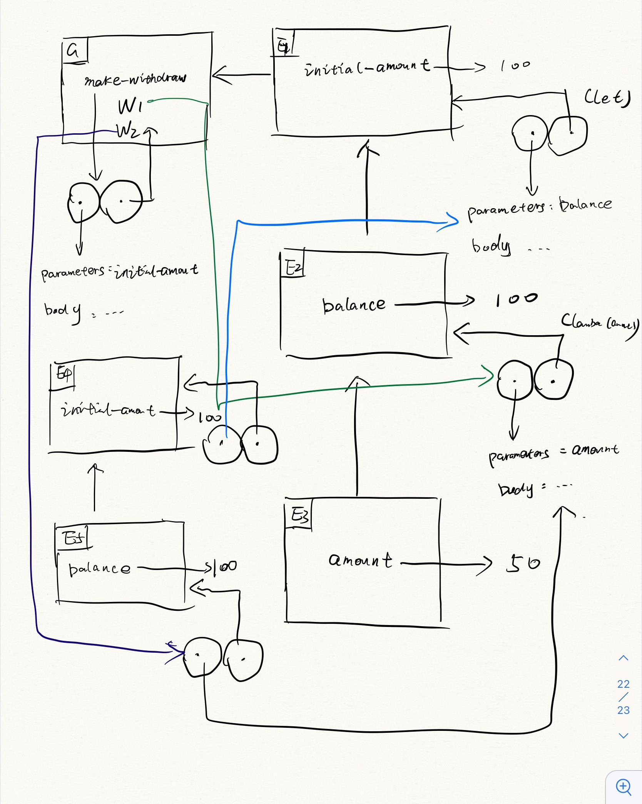

# CS 61A Week 8

Topic: Assignment, state, environments

Reading: Abelson & Sussman, Section 3.1, 3.2

Also read "Object-Oriented Programming--Below-the-line-view"

## Homework

Problem 1: Abelson & Sussman, exercises 3.3, 3.4, 3.7, 3.8, 3.10, 3.11

**3.3:**

```Scheme
(define (make-account balance secret)
  (define (withdraw amount)
    (if (>= balance amount)
        (begin (set! balance (- balance amount))
               balance)
        "Insufficient funds"))
  (define (deposit amount)
    (set! balance (+ balance amount))
    balance)
  (define (dispatch user-secret m)
    (if (eq? user-secret secret)
      (cond ((eq? m 'withdraw) withdraw)
            ((eq? m 'deposit) deposit)
            (else (error "Unknown request: MAKE-ACCOUNT" m)))
      (lambda (x) "Incorrect password")))
  dispatch)
```

**3.4:**

```Scheme
(define (make-account balance secret)
  (let ((error-time 0))
    (define (withdraw amount)
      (if (>= balance amount)
          (begin (set! balance (- balance amount))
                 balance)
          "Insufficient funds"))
    (define (deposit amount)
      (set! balance (+ balance amount))
      balance)
    (define(call-the-cops)
      '110)
    (define (dispatch user-secret m)
      (if (eq? user-secret secret)
        (begin (set! error-time 0)       
               (cond ((eq? m 'withdraw) withdraw)
                     ((eq? m 'deposit) deposit)
                     (else (error "Unknown request: MAKE-ACCOUNT" m))))
        (begin (set! error-time (+ 1 error-time))
               (lambda (x)
                  (if (> error-time 7)
                      (call-the-cops)
                      (lambda (x) "Incorrect password"))))))
    dispatch))
```

**3.7:**

```Scheme
(define (make-account balance secret)
  (let ((joint-secret secret))
    (define (withdraw amount)
      (if (>= balance amount)
          (begin (set! balance (- balance amount))
                 balance)
          "Insufficient funds"))
    (define (joint-account secret)
      (set! joint-secret secret))
    (define (deposit amount)
      (set! balance (+ balance amount))
      balance)
    (define (dispatch user-secret m)
      (if (or (eq? user-secret secret)
              (eq? user-secret joint-secret))
        (cond ((eq? m 'withdraw) withdraw)
              ((eq? m 'deposit) deposit)
              ((eq? m 'joint) joint-account)
              (else (error "Unknown request: MAKE-ACCOUNT" m)))
        (error "Incorrect password")))
    dispatch))

(define (make-joint account oldpwd newpwd)
  (begin ((account oldpwd 'joint) newpwd)
         account))
```

**3.8:**

```Scheme
(define f
  (let ((a 1))
    (lambda (x)
      (begin (set! a (* a x))
             (if (= (/ a 2) 0)
                 0
                 1)))))
```

**3.10:**



**3.11:**


The local state for `acc` kept is `balance`.

When we define a new instance from `make-account`, we will make a total new Enviroment, and we will store the `balance` in it, so the local states for the two accounts will keep distinct.

The global environment will be shared between `acc` and `acc2`.

## Extra for experts

TODO
